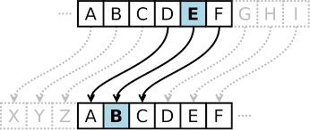

# 🔐 Caesar Cipher

📖 Introduction

The Caesar Cipher is one of the oldest and simplest encryption techniques. Named after Julius Caesar, it encrypts plaintext by shifting each letter by a fixed number of positions in the alphabet. Despite its simplicity, it is an essential building block in the history of cryptography and is often used for educational purposes. 🏛️

---

## ⚙️ How It Works

- 🔑 **Encryption**: Each letter in the plaintext is replaced by the letter a fixed number of positions down the alphabet.  
  - Example: With a shift of `3`, `A` becomes `D`, `B` becomes `E`, and so on.  
  - 🌀 **Wrap-around**: After `Z`, it starts again from `A`.

- 🔓 **Decryption**: To reverse the process, each letter in the ciphertext is replaced by shifting in the opposite direction.

- ✨ **Handling Cases**:
  - 🔤 Uppercase and lowercase letters are shifted separately.
  - 🎯 Non-alphabetic characters remain unchanged.

---

## 📐 Formula

The Caesar Cipher uses modular arithmetic to handle wrapping around the alphabet. For a letter `L` and a key `k`:

- **🔑 Encryption**:  
  `E(L) = (L + k) mod 26`
  
- **🔓 Decryption**:  
  `D(L) = (L - k) mod 26`

---

## 🌟 Features of This Implementation

✅ Handles both **uppercase** and **lowercase** letters.  
✅ Preserves **spaces, numbers, and special characters** in the text.  
✅ Allows user-defined shift values.  
✅ Prevents key errors by wrapping around the alphabet using modular arithmetic.
